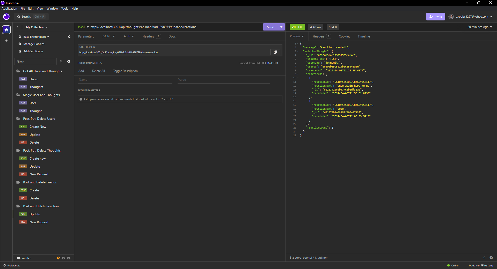

# Social Network API!

Our assignment for Week 18 is to create a social network API with the usual CRUD!
Follow the video below to see the endpoints in action.
## Table of Contents

- [Usage](#usage)
- [Credits](#credits)
- [License](https://choosealicense.com/licenses/mit/)
- [Questions](#questions)
## Usage
- Use the link below to watch a demo!
    - [CLICK HERE](https://youtu.be/SP8GGQyuzdQ)

## Screenshots

## Credits

UofM-VIRT-FSF-PT-10-2023-U-LOLC-ENTG
## License

[MIT](https://choosealicense.com/licenses/mit/)

## Questions

For questions about this project, please contact [CallBeyond](https://github.com/CallBeyond) at d.robles1297@Yahoo.com.